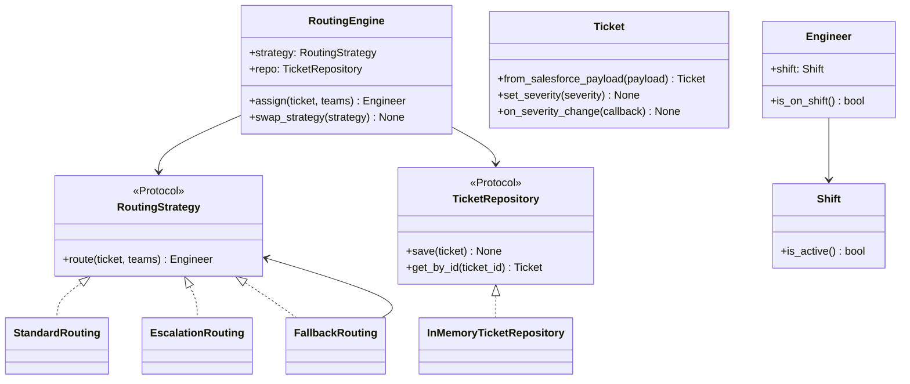

# celonis-support-utils

[](https://github.com/brycepaquette/celonis-support-utils/actions/workflows/ci.yml)
[](https://codecov.io/github/brycepaquette/celonis-support-utils)

A Python package implementing a customer support ticket routing domain, built as a deliberate exercise in object-oriented design, type safety, and production-grade Python project structure.

---

## What this is

This package models the core domain of a support ticket routing system: tickets arrive from Salesforce, get validated, and are routed to the right engineer based on regional availability, shift schedule, and workload. Engineers are assigned to the ticket with the lowest open ticket count among those currently on shift.

It is not a toy project. Every design decision was made with a specific reason, and the architecture reflects real constraints from the Celonis support domain.

---

## Package layout

```
src/celonis_support_utils/
├── enums.py                # Region, DayOfWeek, ServiceLevel — shared across the domain
├── shift.py                # Shift — owns shift window logic via is_active()
├── customer.py             # Customer — frozen dataclass; company name + service level
├── ticket.py               # Ticket + IssueType + Severity + TicketStatus
├── engineer.py             # Engineer — delegates shift availability to Shift
├── team.py                 # Team — owns a list of Engineers, carries Region
├── queue.py                # Queue[T] — generic FIFO queue
├── validators.py           # Shared parse_region() and require_non_empty() utilities
├── payloads.py             # TypedDict definitions for Salesforce payloads
├── exceptions.py           # NoAvailableEngineerError — structured, actionable exception
├── repository.py           # TicketRepository Protocol + InMemory + Salesforce stubs
├── routing_strategy.py     # RoutingStrategy Protocol, StandardRouting, EscalationRouting, FallbackRouting
├── routing_engine.py       # RoutingEngine — orchestrates strategy + repository
├── notification_sender.py  # NotificationSender ABC + SlackSender
└── __init__.py             # Full public API export
```

---

## Architecture



### Key relationships

- `Ticket` carries `IssueType`, `Severity | None`, `TicketStatus`, and `Region`: all parsed from Salesforce string payloads at the boundary
- `Team` has-a `list[Engineer]`, carries `Region`
- `Engineer` has-a `Shift`: delegates `is_on_shift()` to it
- `Shift` owns `is_active()`: checks current time against the shift window in the shift's timezone
- `RoutingEngine` has-a `RoutingStrategy` and a `TicketRepository`; orchestrates the assign flow
- `RoutingStrategy` is a `Protocol`: any class with a matching `route(ticket, teams)` signature satisfies it

### Routing logic

`StandardRouting.route(ticket, teams) -> Engineer`

1. Filter teams by region: `GLOBAL` tickets route to any team; otherwise only the matching region
2. Collect all engineers currently on shift across eligible teams
3. Return the engineer with the lowest `open_ticket_count`, or raise `NoAvailableEngineerError`

`FallbackRouting.route(ticket, teams) -> Engineer`

Wraps two strategies. Tries primary; if it raises `NoAvailableEngineerError`, tries secondary. If both fail, raises with a combined reason. Alerting is the caller's responsibility. `FallbackRouting` does not know about `NotificationSender`.

### Data flow

```
Salesforce payload (dict)
    → Ticket.from_salesforce_payload()   # validates, parses strings to enums
    → RoutingEngine.assign()             # calls strategy.route(), stamps assignee, saves
    → TicketRepository.save()            # persists
```

---

## OOP patterns applied

| Pattern | Where | Why |
|---|---|---|
| **Strategy** | `RoutingStrategy` Protocol + `StandardRouting`, `EscalationRouting`, `FallbackRouting` | Swap routing behaviour at runtime without modifying the engine |
| **Factory method** | `Ticket.from_salesforce_payload()`, `Shift.from_raw()`, `Customer.from_salesforce_payload()` | Centralise construction and validation from raw external data |
| **Repository** | `TicketRepository` Protocol + `InMemoryTicketRepository`, `SalesforceTicketRepository` | Decouple storage from domain logic; swap implementations without touching business code |
| **Observer** | `Ticket.on_severity_change()` + severity property setter | React to severity changes without coupling the ticket to notification or escalation logic |
| **Composition** | `Engineer` has-a `Shift`, `RoutingEngine` has-a `RoutingStrategy` + `TicketRepository` | All domain relationships are has-a, not is-a |
| **Protocol** | `RoutingStrategy`, `TicketRepository` | Structural subtyping — third-party implementations need no import or inheritance |

---

## Design decisions

**Why Protocol over ABC for `RoutingStrategy`?**
Any new routing strategy, including third-party or external implementations, would need to explicitly inherit from an ABC, creating a hard dependency on this codebase. With Protocol, any class with a matching `route(ticket, teams)` signature satisfies the interface automatically. No import, no inheritance required.

**Why composition over inheritance throughout?**
All domain relationships are has-a, not is-a. `Engineer` has-a `Shift` and delegates `is_on_shift()` to it. `RoutingEngine` has-a `RoutingStrategy`, which allows hot-swapping routing behaviour at runtime via `swap_strategy()` without modifying the engine. If `RoutingEngine` had inherited from a routing strategy, each variation would require its own subclass which is rigid and hard to extend.

**Why frozen dataclasses for `Shift` and `Customer`?**
Both are value objects — their identity is defined entirely by their data, and that data should not change after construction. `frozen=True` prevents unintended mutation and provides `__eq__` and `__hash__` automatically. Because frozen dataclasses expect already-typed values, a `from_raw()` classmethod handles string parsing at the boundary, keeping a clean separation: the dataclass holds typed data, `from_raw()` is the parser.

**Why `Severity | None`?**
Question and Service Request tickets genuinely have no severity. It is not a missing value, it is an inapplicable one. Defaulting to `SEV4` would be lying in the domain model and would make it impossible to distinguish "assessed as SEV4" from "no severity applicable." The `None` case ripples through the property, setter, and callbacks — that ripple is correct.

**Why `open_ticket_count` as a field on `Engineer`?**
The alternative, per-engineer API calls, means n Salesforce queries per routing decision. The correct approach is one bulk query that fetches all open tickets, then builds a count map in Python. `Engineer` objects are constructed fresh before each routing call with current counts already set. One I/O boundary, pure Python logic after that.

**What was considered and rejected:**
- Embedding a full `Customer` object on `Ticket` : rejected to keep `Ticket` focused on a single responsibility. Resolving customer details is the routing layer's concern.
- `ABC` for `RoutingStrategy` : started with this, switched to Protocol when it became clear any new strategy would need to import from this codebase.
- Per-engineer API calls for `open_ticket_count` : rejected in favour of the bulk query pattern.

---

## What's next

- **`EscalationRouting`** — deliberately stubbed. Requires an on-call schedule integration (PagerDuty, Google Calendar, etc.) that lives outside this codebase. Design: `OnCallRepository` Protocol, same pattern as `TicketRepository`.
- **`SalesforceTicketRepository`** stub in place. The real implementation requires Salesforce API credentials and the bulk query pipeline that feeds `open_ticket_count` into `Engineer` construction.
- **`Queue`** — currently a generic FIFO wrapper. A production queue would be backed by a message broker with persistence and concurrency handling.

---

## What I'd do differently

**Start with real Salesforce payload shapes.** I designed the domain in isolation, then discovered that actual Salesforce field names and status values didn't match my assumptions. Several renaming passes mid-build would have been avoided by inspecting real payloads before writing a single class.

**Extract observer registration from `Ticket`.** `Ticket` holds its own `_severity_callbacks` list, which mixes data model with event infrastructure. I'd extract a separate `EventBus` that `Ticket` publishes to. That keeps `Ticket` a pure data object and the event wiring explicit and testable on its own.

**Stop the `"-"` sentinel from leaking into the domain.** `from_salesforce_payload` checks for `"-"` to detect absent severity — that's Salesforce's null representation bleeding into the domain layer. The `SalesforceTicketPayload` TypedDict should carry `severity: str | None` and handle the sentinel at the boundary, so nothing below it ever sees `"-"`.

**Add an integration test.** Unit tests cover each class in isolation, but there's no test that walks the full flow: payload arrives → `Ticket.from_salesforce_payload()` → `RoutingEngine.assign()` → observer fires → `TicketRepository.save()`. That end-to-end test would catch integration bugs that unit tests structurally cannot.

**Let patterns emerge rather than applying them deliberately.** Some design choices here — notably the Observer on `Ticket` — were made because they were on the learning plan, not because the problem demanded them. A production codebase should reach for a pattern when it solves a real pain point, not to demonstrate it.

---

## Type safety and tooling

- Full type hints throughout — `mypy --strict` passes clean across all 15 source files
- `ruff` for linting — zero warnings
- `pre-commit` hooks run on every commit
- `pytest` test suite with 10 test modules covering all public classes
- `pytest-mock` for `MagicMock` and `mocker.patch()` based tests
- 90% test coverage reported via Codecov
- GitHub Actions CI runs on every push: ruff → mypy → pytest → coverage upload

---

## Getting started

**Requirements:** Python 3.12+, [uv](https://docs.astral.sh/uv/)

```bash
git clone https://github.com/brycepaquette/celonis-support-utils
cd celonis-support-utils

# Install uv if you don't have it
curl -LsSf https://astral.sh/uv/install.sh | sh

uv sync --all-extras

uv run pytest                                        # run tests
uv run pytest --cov=src --cov-report=term-missing   # with coverage
uv run mypy src/ --strict                            # type checking
uv run ruff check .                                  # linting
```

## CLI

```bash
# Route a ticket using the default (standard) strategy
sca route TICKET-123

# Route a ticket using the escalation strategy
sca route TICKET-123 --strategy escalation
```

---

## Project context

Built as Month 1 of a 12-month AI/Robotics learning roadmap, focused on writing structured, production-grade Python. The goal: move from "comfortable with Python" to "writes code like a senior developer". Typed, tested, linted, and CI-backed.
